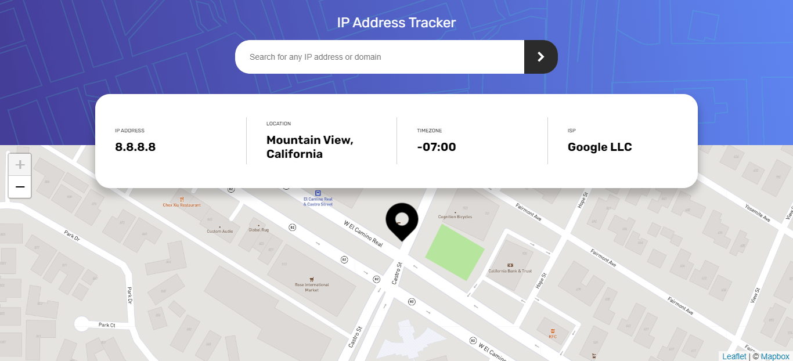
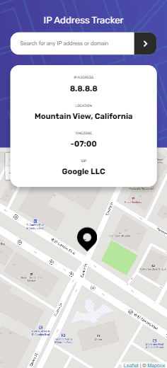

# Frontend Mentor - IP address tracker solution

This is a solution to the [IP address tracker challenge on Frontend Mentor](https://www.frontendmentor.io/challenges/ip-address-tracker-I8-0yYAH0). Frontend Mentor challenges help you improve your coding skills by building realistic projects. 

## Table of contents

- [Overview](#overview)
  - [The challenge](#the-challenge)
  - [Screenshot](#screenshot)
  - [Links](#links)
  - [Getting Started](#getting-started)
- [My process](#my-process)
  - [Built with](#built-with)
- [Author](#author)

## Overview

### The challenge

Users should be able to:

- View the optimal layout for each page depending on their device's screen size
- See hover states for all interactive elements on the page
- See their own IP address on the map on the initial page load
- Search for any IP addresses or domains and see the key information and location

### Screenshot




### Links

- Solution URL: [Deploy in Vercel](https://iptracker-lime.vercel.app/)

### Getting Started

First, run the development server:

```bash
npm run dev
# or
yarn dev
```

Open [http://localhost:3000](http://localhost:3000) with your browser to see the result.

## My process

### Built with

- [React](https://reactjs.org/) - JS library
- [Next.js](https://nextjs.org/) - React framework
- [Axios](https://github.com/axios/axios) - For HTTP requests 
- [Leaflet](https://leafletjs.com/) - For the Map
- [Sass](https://sass-lang.com/) - For styles
- [IP Geolocation API by IPify](https://geo.ipify.org/) - To get the IP Address locations


## Author

- Linkedin - [Jefferson](https://www.linkedin.com/in/jefferson-c-silva-aa1b7b1a9/)
- Frontend Mentor - [@jefferson00](https://www.frontendmentor.io/profile/Jefferson00)


